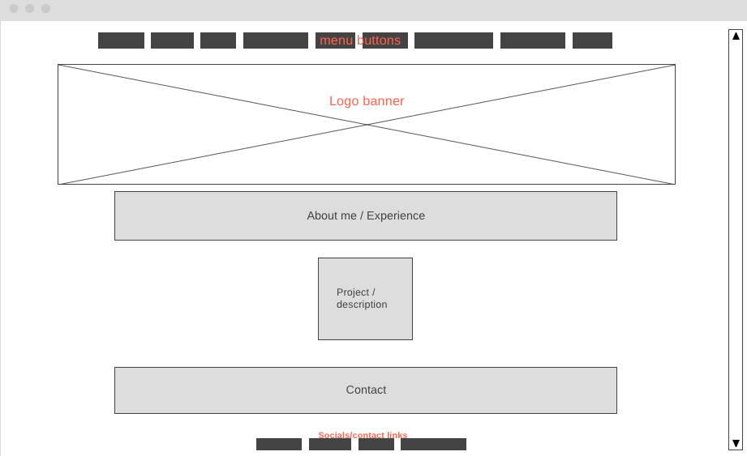

# Ella's Portfolio 

## Project Schedule 

| Day | Deliverable    | Status |
| :---:   | :---: | :---: | 
| Day 1 | Project Description    | Complete | 
| Day 2 | Wireframes / Priority Matrix / Timeline    | Complete |
| Day 3 | Core Application Structure (HTML, CSS, etc.)	    | Complete | 
| Day 4 | MVP & Bug Fixes	    | Incomplete |
| Day 5 | Final Touches	    | Incomplete | 
| Day 6 | Present    | Incomplete |


## Wireframe 


## Time/Priority Matrix 
#### MVP 

| Component | Priority  | Estimated Time  | Actual Time | 
| ------- | --- | --- | ------- |
| Top Navbar Menu	 | H | 1hr | hr | 
| Project Previews	 | H | 3hrs | hr | 
| Color palette	 | H | 1hr | hr | 
| Adding Form	 | H | 1.5hrs | hr | 
| Other sections and flex	 | M | 3hrs | hr | 
| Working with API	 | H | 3hrs | hr | 
| Responsive | H | 3hrs | hr | 
| Social Media Icons	 | L | 1hr | hr | 
| Total | H | 15.5hrs | hr | 

#### PostMPV 

| Component | Priority  | Estimated Time  | Actual Time | 
| ------- | --- | --- | ------- |
| Project Hover | L | 3hr | -hr | hr |
| Icon wiggle | L | 1hr | hr |
| Banner | M | 4hr | hr |
| Materialize | H | 4hr | -hr | hr |
| Bootstrap | H | 4hr | hr |
| Put text over banner image | L | 4hr | hr |
| Total | H | 20hrs| hrs |

## Additional Libraries Used 
In this section, I'll share a list of all supporting libraries and their role in the project.

https://www.w3schools.com/
I found W3Schools very helpful when my codes were not working. I had trouble with making the image from my projects section move and found it a helpful resource.  

https://unsplash.com/photos/5JE9AQqWo_Q 
Unsplash has plenty of awesome free background images available to download. That's where I found my background. I really love 3d rendered images and absolutely loved the colors of my banner. 

https://www.flaticon.com/
Flaticon is where I found the image for my project and all the icons from my Contact section! They have lots of fun and FREE icons that I will use from here on out.

https://giphy.com/
There's honestly not a day where I don't send out a GIF to someone. It's become a norm for me and had to include a fun one on my site.

## Code Snippet
This section will include a brief code snippet of functionality that I'm proud of in a brief description.

 ```
function myCoolThing() {
	// here is the code to do something really cool!
 ```   

## Issues and Resolutions
I will use this section to list all of the major issues I encountered and their resolution.